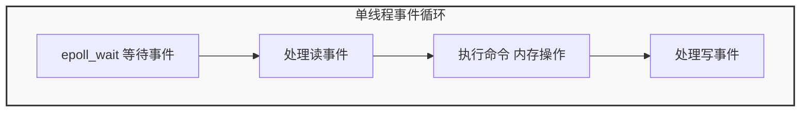

# Redis基础

[Redis](https://redis.io/) （**RE**mote **DI**ctionary **S**erver）是一个基于 C 语言开发的开源 NoSQL 数据库（BSD 许可）。与传统数据库不同的是，Redis 的数据是保存在内存中的（内存数据库，支持持久化），因此读写速度非常快，被广泛应用于分布式缓存方向。并且，Redis 存储的是 KV 键值对数据。

为了满足不同的业务场景，Redis 内置了多种数据类型实现（比如 String、Hash、Sorted Set、Bitmap、HyperLogLog、GEO）。并且，Redis 还支持事务、持久化、Lua 脚本、发布订阅模型、多种开箱即用的集群方案（Redis Sentinel、Redis Cluster）。

## Redis的数据类型


1. **String（字符串）**
   - 二进制安全，可以存储任意数据：字符串、数字、甚至图片或序列化数据。
   - 最大容量：单个 value 最多 512MB。
   - 常见操作：`SET`、`GET`、`INCR`、`DECR`、`APPEND`。
   - 使用场景：缓存对象、计数器、分布式锁。
2. **List（列表）**
   - 一个有序的双向链表，可以从两端插入和弹出元素。
   - 保持插入顺序，支持重复元素。
   - 常见操作：`LPUSH`、`RPUSH`、`LPOP`、`RPOP`、`LRANGE`。
   - 使用场景：消息队列、任务队列、最新列表展示（如微博时间线）。
3. **Hash（哈希表）**
   - 存储键值对（field-value），适合存储对象。
   - 常见操作：`HSET`、`HGET`、`HMGET`、`HDEL`。
   - 使用场景：用户信息表（id → {name, age, email}）。
4. **Set（集合）**
   - 无序集合，不允许重复。
   - 底层实现：哈希表，查找和去重效率高。
   - 常见操作：`SADD`、`SMEMBERS`、`SINTER`、`SUNION`、`SDIFF`。
   - 使用场景：去重、好友关系（交集求共同好友，差集求可能认识的人）。
5. **Sorted Set（有序集合，Zset）**
   - 每个成员（member）关联一个分数（score），按分数排序。
   - 分数可以相同，但成员不能重复。
   - 常见操作：`ZADD`、`ZRANGE`、`ZREVRANGE`、`ZRANK`、`ZREM`。
   - 使用场景：排行榜（按分数、时间排序）、带权重的数据。

6. **Bitmap（位图）**

- 基于 String 的位操作，节省存储空间。
- 常见操作：`SETBIT`、`GETBIT`、`BITCOUNT`。
- 使用场景：签到打卡、用户在线状态统计、布隆过滤器底层。

7. **HyperLogLog**

- 用于基数统计（去重计数），占用空间固定（12KB）。
- 常见操作：`PFADD`、`PFCOUNT`、`PFMERGE`。
- 使用场景：网站 UV 统计、活跃用户数。

8. **Geospatial（地理空间数据）**

- 基于 Zset 实现，可以存储经纬度并进行范围查询。
- 常见操作：`GEOADD`、`GEODIST`、`GEORADIUS`。
- 使用场景：附近的人、地图服务。

9. **Stream（流，Redis 5.0 引入）**

- 消息队列结构，支持持久化和消费组。
- 常见操作：`XADD`、`XREAD`、`XGROUP`、`XREADGROUP`。
- 使用场景：消息队列、日志系统、实时数据处理。

| 类型        | 是否有序 | 是否允许重复 | 典型场景         |
| ----------- | -------- | ------------ | ---------------- |
| String      | 否       | 否           | 缓存、计数器、锁 |
| List        | 有序     | 允许         | 队列、时间线     |
| Hash        | 无序     | field 唯一   | 存储对象信息     |
| Set         | 无序     | 否           | 去重、集合运算   |
| Sorted Set  | 有序     | 否           | 排行榜           |
| Bitmap      | 位序列   | 位唯一       | 签到、状态标记   |
| HyperLogLog | N/A      | 概率去重     | UV 统计          |
| Geo         | 按距离   | 否           | 地理位置服务     |
| Stream      | 有序     | 允许         | 消息队列         |

## redis效能

1. 纯内存操作：所有读写发生在内存中，而非持久化到磁盘上。
2. 高效的IO模型：采用了单线程事件以及IO多路复用。
3. 优化的内部数据结构：如ziplist，quicklist，skiplist，hashtable
4. 采用了自定义的通信协议：RESP

## 其他的分布式缓存技术

### Memcached

## Tendis

## Dragonfly

## keyDB

## Faster


# Redis常见问题


## 问什么要用分布式缓存

| 特性         | 本地缓存                             | Redis                            |
| ------------ | ------------------------------------ | -------------------------------- |
| 数据一致性   | 多服务器部署时存在数据不一致问题     | 数据一致                         |
| 内存限制     | 受限于单台服务器内存                 | 独立部署，内存空间更大           |
| 数据丢失风险 | 服务器宕机数据丢失                   | 可持久化，数据不易丢失           |
| 管理维护     | 分散，管理不便                       | 集中管理，提供丰富的管理工具     |
| 功能丰富性   | 功能有限，通常只提供简单的键值对存储 | 功能丰富，支持多种数据结构和功能 |

## 常见的缓存更新策略有哪些

### Cache Aside(旁路缓存)

写流程：

1. 更新DB
2. 删除缓存

读流程：

1. 查缓存，命中直接返回，未命中转2
2. 查数据库
3. 更新缓存

**为什么写流程不能先删除后更新？**

#### 场景复现（先删除后写）

1. **线程 A**：删除缓存。
2. **线程 B**：读取数据，发现缓存没了，去查数据库，读到的是旧值。
3. **线程 A**：更新数据库。
4. **线程 B**：把旧值写回缓存。

👉 结果：**缓存里是旧值**，数据库里是新值，缓存和数据库不一致。

#### 场景复现（先写后删除）

1. **线程 A**：更新数据库。
2. **线程 B**：读取数据，发现缓存存在，直接返回旧值。
3. **线程 A**：删除缓存。
4. **线程 C**：读取数据，发现缓存不存在，去数据库里面查数据库，然后更新缓存。

👉 结果：到线程B时**缓存为空**，数据库里是新值，缓存和数据库**短暂**不一致，短暂不一致在后续线程C时会更新缓存保证**最终一致性**。

#### 场景复现（先写后删除依旧有问题）

1. **线程 A**：读取数据，但数据不在缓存中，去数据库中读取到旧数据。
2. **线程 B**：写数据库。
3. **线程 B**：删除缓存。
4. **线程 A**：更新缓存为旧数据。

👉 结果：此时仍然会出现缓存和DB数据不一致的情况。

#### 优化手段

延迟双删：为了解决短暂的不一致性，更新数据库后：先写数据库→ 删缓存 → sleep 一段时间 → 再删一次缓存，能够解决并发读写导致的脏数据。确保第二次删除能够覆盖所有旧数据的缓存。

- 优点：
  - 适合缓存一致性要求高，但无法满足完全实时一致性。

- 缺点：
  - 增加系统复杂度。
  - 无法满足会完全实时一致性的场景。

**缺点1**：**解决首次请求数据一定不在 cache 的问题**，将热点数据提前放入redis中。

**缺点2**：

数据库和缓存数据强一致场景：更新 db 的时候同样更新 cache，不过我们需要加一个锁/分布式锁来保证更新 cache 的时候不存在线程安全问题。

可以短暂地允许数据库和缓存数据不一致的场景：更新 db 的时候同样更新 cache，但是给缓存加一个比较短的过期时间，这样的话就可以保证即使数据不一致的话影响也比较小。

### Read Through Pattern 读穿透

读：

1. 查缓存，命中直接返回，未命中转2
2. 查数据库，更新缓存，返回数据库


### Write Through Pattern（写穿透）

写：

1. 先查cache，cache不存在，直接更新db
2. cache中存在，先更新cache，**同步**更新DB（缓存和DB在同一事务中写）

Read-Through Pattern 实际只是在 Cache-Aside Pattern 之上进行了封装。在 Cache-Aside Pattern 下，发生读请求的时候，如果 cache 中不存在对应的数据，是由客户端自己负责把数据写入 cache，而 Read Through Pattern 则是 cache 服务自己来写入缓存的，这对客户端是透明的。

> 实际上redis并不提供读写穿透的策略，redis自己无法去写DB

### Read Back （写回）

写：

1. 先查cache，cache不存在，直接更新db
2. cache中存在，先更新cache，**异步**更新DB

优点：

​	减少数据库压力

缺点：

​	数据丢失风险（缓存宕机，数据没落库）。

​	一致性较弱，适合对一致性要求不高的场景。


# Redis底层结构以及实现

Redis是**单线程事件驱动**的内存数据库，主要框架

```
客户端 <-> 网络事件模块 <-> 命令解析模块 <-> 数据结构模块 <-> 持久化模块
```

| 模块                  | 功能                                     |
| --------------------- | ---------------------------------------- |
| **网络 I/O**          | 基于 epoll 的 Reactor 模型，非阻塞 I/O   |
| **命令解析器**        | 解析客户端请求（RESP 协议）              |
| **数据结构模块**      | 实现各种类型的键值对                     |
| **持久化模块**        | RDB / AOF                                |
| **内存管理**          | 自定义内存分配（jemalloc）               |
| **多线程模块（I/O）** | 只在读写网络时用多线程，核心逻辑仍单线程 |


## 底层结构

Redis的所有`key-value`都保存在全局哈希表里面：

```
dict *db
```

每个`key-value`都是一个`dictEntry`：

```
typedef struct dictEntry {
    void *key;
    void *val;
    struct dictEntry *next;
} dictEntry;

```

> 当出现哈希冲突时，形成链表

`val`是一个`redisObject`结构，有不同的编码方式：

```
typedef struct redisObject {
    unsigned type:4;  // 数据类型 (string/list/set/zset/hash)
    unsigned encoding:4; // 编码方式
    void *ptr;        // 指向底层数据结构
} robj;

```

| Redis 类型                 | 底层结构（encoding）                        | 说明                                                  |
| -------------------------- | ------------------------------------------- | ----------------------------------------------------- |
| **String**                 | SDS（简单动态字符串）                       | 类似 `char*`，但有 length、预分配空间，支持二进制安全 |
| **List**                   | `ziplist`（旧） / `quicklist`（新）         | 双端链表 + 压缩块，兼顾随机访问和内存效率             |
| **Hash**                   | `ziplist`（小） / `hashtable`（大）         | 小数据紧凑存储，大数据用哈希表                        |
| **Set**                    | `intset`（小） / `hashtable`（大）          | 小集合用整数数组，大集合用哈希表                      |
| **ZSet（有序集合）**       | `ziplist`（小） / `skiplist` + `dict`（大） | 跳表 + 哈希表，支持按分数范围查询                     |
| Stream                     | radix tree+list pack                        |                                                       |
| Bitmap                     | String                                      | 位操作在String上实现                                  |
| HyperLog Log               | 稀疏/稠密数组 + hash                        |                                                       |
| Geo                        | Zset+GeoHash                                |                                                       |
| Bloom Filter（布隆过滤器） | bitmap+hash                                 |                                                       |

### String(SDS)

Redis的字符串不是char*而是

```
struct sdshdr {
    int len;       // 实际长度
    int alloc;     // 分配空间
    char buf[];    // 内容
};

```

### List双端链表

#### ZipList

在Redis<3.2：使用`ziplist`压缩表

ZipList划分为多个字段


- 1、**zlbytes**：压缩列表的字节长度，占4个字节，因此压缩列表最长(2^32)-1字节；
- 2、**zltail**：压缩列表尾元素相对于压缩列表起始地址的偏移量，占4个字节；
- 3、**zllen**：压缩列表的元素数目，占两个字节；那么当压缩列表的元素数目超过(2^16)-1怎么处理呢？此时通过zllen字段无法获得压缩列表的元素数目，必须遍历整个压缩列表才能获取到元素数目；
- 4、**entryX**：压缩列表存储的若干个元素，可以为字节数组或者整数；entry的编码结构后面详述；
- 5、**zlend**：压缩列表的结尾，占一个字节，恒为**0xFF**。

例如


代表这个ziplist的总空间大小为0x50，到尾部的偏移量为0x3c(0d60)，即最后一个entry3的地址为p+60，数组长度为0x3，最后一个字节默认为0xFF。

每个压缩列表节点的具体构成为


- previous_entry_length：这个属性记录了压缩列表前一个节点的长度，**该属性根据前一个节点的大小不同可以是1个字节或者5个字节。**
  - 如果前一个节点的长度小于254个字节，那么previous_entry_length的大小为1个字节，**即前一个节点的长度可以使用1个字节表示。**
  - 如果前一个节点的长度大于等于254个字节，那么previous_entry_length的大小为5个字节**，第一个字节会被设置为0xFE(十进制的254），之后的四个字节则用于保存前一个节点的长度。**

、

该字段设计主要是为了查找前一个节点，使用当前节点的地址减去前一个节点的长度即可获得前一个节点的开始地址。

- encoding：表示content的编码方式以及长度，
  - 一字节、两字节或者五字节长， 值的最高位为 00 、 01 或者 10 的是字节数组编码： 这种编码表示节点的 content 属性保存着字节数组， 数组的长度由编码除去最高两位之后的其他位记录
  - 一字节长， 值的最高位以 11 开头的是整数编码： 这种编码表示节点的 content 属性保存着整数值， 整数值的类型和长度由编码除去最高两位之后的其他位记录；


- content：内容根据encoding部分决定。


#### 连锁更新

由于previous_entry_lenth的长度是动态变化的，因此添加节点或者删除节点时可能会导致后一个节点的长度变化

**即使存在这种情况，但是并不影响我们使用压缩列表**

压缩列表里要恰好有多个**连续的、长度介于 250 字节至 253 字节之间的节点， 连锁更新才有可能被引发， 这种情况就和连中彩票一样，很少见 (yes 懂了)**

即使出现连锁更新， 但只要被更新的节点数量不多， 就不会对性能造成任何影响： 比如说， 对三五个节点进行连锁更新是绝对不会影响性能的；

#### 特点

- 结构紧凑：一整块连续内存，没有多余的内存碎片，更新会导致内存 realloc 与内存复制，平均时间复杂度为 `O(N)`
- **逆向遍历：从表尾开始向表头进行遍历(注意了！，但是插入还是在表头)**
- 连锁更新：对前一条数据的更新，可能导致后一条数据的 prev_entry_length 与 encoding 所需长度变化，产生连锁反应，更新操作最坏时间为 `O(N^2)`

#### QuickList

在较早版本的 redis 中，list 有两种底层实现：

- **当列表对象中元素的长度比较小或者数量比较少的时候，采用压缩列表 ziplist 来存储**
- **当列表对象中元素的长度比较大或者数量比较多的时候，则会转而使用双向列表 linkedlist 来存储**

两者各有优缺点：

- **ziplist 的优点是内存紧凑，访问效率高，缺点是更新效率低，并且数据量较大时，可能导致大量的内存复制**
- **linkedlist 的优点是节点修改的效率高，但是需要额外的内存开销，并且节点较多时，会产生大量的内存碎片**

为了结合两者的优点，**在 redis 3.2 之后，list 的底层实现变为快速列表 quicklist**。
快速列表是 linkedlist 与 ziplist 的结合: quicklist 包含多个内存不连续的节点，但每个节点本身就是一个 ziplist。


在Redis＞3.2：使用链表和`ziplist`结合的`quickList`

#### quickListNode结构

```c
typedef struct quicklistNode {
    struct quicklistNode *prev;  //前一个quicklistNode
    struct quicklistNode *next;  //后一个quicklistNode
    unsigned char *zl;           //quicklistNode指向的ziplist
    unsigned int sz;             //ziplist的字节大小
    unsigned int count : 16;     //ziplist中的元素个数
    unsigned int encoding : 2;   //编码格式，原生字节数组或压缩存储
    unsigned int container : 2;  //存储方式
    unsigned int recompress : 1; //数据是否被压缩
    unsigned int attempted_compress : 1; //数据能否被压缩
    unsigned int extra : 10;     //预留的bit位
} quicklistNode;

```

prev、next指向该节点的前后节点；

zl指向该节点对应的ziplist结构；

sz代表整个ziplist结构的大小；

encoding代表采用的编码方式：1代表是原生的，2代表使用LZF进行压缩；

container为quicklistNode节点zl指向的容器类型：1代表none,2代表使用ziplist存储数据

recompress代表这个节点之前是否是压缩节点，若是，则在使用压缩节点前先进行解压缩，使用后需要重新压缩，此外为1，代表是压缩节点；

attempted_compress测试时使用；

extra为预留

#### quickList

```
typedef struct quicklist {
    quicklistNode *head;   // quicklist的链表头
    quicklistNode *tail;   // quicklist的链表尾
    unsigned long count;   // 所有ziplist中的总元素个数
    unsigned long len;     // quicklistNodes的个数
    int fill : QL_FILL_BITS;  // 单独解释
    unsigned int compress : QL_COMP_BITS; // 具体含义是两端各有compress个节点不压缩
    ...
} quicklist;

```

fill用来指明每个quicklistNode中ziplist长度，当fill为正数时，表明每个ziplist最多含有的数据项数，当fill为负数时，如下：

- Length -1: 4k，即ziplist节点最大为4KB
- Length -2: 8k，即ziplist节点最大为8KB
- Length -3: 16k ...
- Length -4: 32k
- Length -5: 64k

fill取负数时，必须大于等于-5。可以通过Redis修改参数list-max-ziplist-size配置节点所占内存大小。实际上每个ziplist节点所占的内存会在该值上下浮动。

考虑quicklistNode节点个数较多时，我们经常访问的是两端的数据，为了进一步节省空间，Redis允许对中间的quicklistNode节点进行压缩，通过修改参数list-compress-depth进行配置，即设置compress参数，该项的具体含义是两端各有compress个节点不压缩。

#### quicklist总体结构


```
QuickList
 ├── quicklistNode1 → ziplist1 [a, b, c, d, e]
 ├── quicklistNode2 → ziplist2 [f, g, h, i, j]
 └── quicklistNode3 → ziplist3 [k, l, m, n]

```

**只有当前 quicklistNode 的 ziplist 已满**（超过设定阈值）时，才会新建一个 quicklistNode（及其 ziplist）；
 否则就直接往当前节点的 ziplist 里追加。

#### 分裂机制

如果在 ziplist **中间插入** 元素，导致超出容量上限，
 Redis 会将该 ziplist 一分为二：

```
原 ziplist: [a, b, c, d, e]
插入新元素 'X' 中间后过大：
分裂为：
ziplist1: [a, b, X]
ziplist2: [c, d, e]
```

于是会新建一个 `quicklistNode` 用于第二个 ziplist。
 这样避免某个 ziplist 太大影响性能。

#### 合并机制

当某个ziplist因为删除过小时，其会和相邻的ziplist合并，以减少内存使用。


#### listpack

由于使用ziplist可能会导致：

- 每个 entry 的长度字段（prevlen）需要更新；

- 可能引发整个 ziplist 内存重分配；

- 在极端情况下是 **O(n²)** 的复杂度，所有节点都需要更新。

因此在redis7.0之后使用了listpack彻底代替了ziplist

其结构如下：


相对比ziplist，去除了zltail节点，意味着没法通过O(1)找到列表结尾。其主要改进在ListPackEntry中。

#### ListPackEntry


## Redis的功能

### 分布式锁


### 限流


### 消息队列


### 延时队列


### 分布式Session


### 其他业务场景


# Redis的性能

## 单线程

Redis使用了多路复用IO来处理请求，

Redis 的核心命令执行逻辑仍是**单线程**的：

- 所有 `GET`, `SET`, `ZADD`, `HGET` 等命令都在主线程顺序执行；
- 不存在锁竞争，也不需要上下文切换；
- 因此非常快（内存操作 + 事件循环）。

💡 这正是 Redis 能在百万 QPS 场景下仍然稳定的原因。

## 为什么使用单线程？

因为

Redis 的数据结构（hash、zset、list、dict）操作需要保持原子性；

多线程同时操作相同 key 会产生锁竞争；

多线程下难以保证命令间顺序一致性；

单线程 + I/O 多线程 是一个性能与一致性的最佳平衡点。

## 网络IO多线程

Redis6.0前，完全单线程循环的事件



也就是说：

- Redis 主线程通过 **epoll_wait()** 获取活跃连接；
- 然后顺序执行所有的读、命令、写逻辑；
- 整个过程全在一个 CPU 核上完成。

💡 高效是因为：

- 不用加锁
- 不用上下文切换
- 内存操作极快

而在Redis6.0之后，引入了IO多线程，epoll 仍然负责事件监听；
 但网络读写由多个线程并发完成。

```
flowchart TD
    subgraph main_thread["主线程"]
        A["epoll_wait() 获取活跃 socket"] --> B["将 socket 分发给 I/O 线程池"]
    end

    subgraph io_pool["I/O 线程池"]
        direction TB
        IO1["I/O 线程1\n(读取 socket 数据)"]
        IO2["I/O 线程2\n(解析请求包)"]
        IO3["I/O 线程3\n(写回响应结果)"]
    end

    B --> IO1
    B --> IO2
    B --> IO3

    classDef thread fill:#e6f3ff,stroke:#333,stroke-width:1px;
    classDef pool fill:#f0f0f0,stroke:#666;
    class main_thread,io_pool pool;
    class IO1,IO2,IO3,main_thread thread;


```

epoll 仍然在主线程中使用；

主线程收集活跃连接后，将这些连接分配给多个 I/O 线程；

各线程负责并行 read()/write()；

命令解析与执行仍然在主线程完成。

## 异步删除多线程（懒删除lazy free）

**场景：**
 命令如 `UNLINK`, `FLUSHDB ASYNC`, `FLUSHALL ASYNC` 删除大量键时，如果在主线程中执行，会阻塞整个实例。

**解决：**
 Redis 使用**后台线程池**异步释放内存。

避免主线程阻塞


## AOF/RDB

| 场景                     | 线程              | 说明                           |
| ------------------------ | ----------------- | ------------------------------ |
| AOF 重写（BGREWRITEAOF） | 子进程 + I/O 线程 | 异步重写日志文件               |
| RDB 快照（BGSAVE）       | 子进程            | 异步写入 RDB 文件              |
| AOF fsync                | 后台线程          | 定期将 AOF buffer flush 到磁盘 |

## 集群和复制线程

- Redis Cluster 节点之间的 **gossip 消息**、**replica 同步** 等网络通信也通过独立线程处理；

- 复制时，**主节点发送 RDB 文件** 是在后台子进程中完成；

- 在 Redis 7+ 中引入了 **I/O thread per connection** 的复制机制。

# 哨兵模式

# 集群模式


# Redisson

Redisson 是一款基于 Redis 的 Java 客户端，专注于为分布式应用提供丰富的分布式对象和服务。它不仅仅是 Redis 的简单操作 API，更封装了分布式锁、分布式集合（如分布式 Map、Set、List）、队列、Semaphore、CountDownLatch 等，并支持自动重连、连接池、序列化、自定义编解码等多种特性，非常适合 Java 分布式应用对 Redis 的高阶需求。

常用场景包括：
- 分布式锁（可重入锁、公平锁、读写锁等）
- 分布式限流
- 分布式对象存储（如 RMap/RList）
- 定时任务 & 延迟队列
- 发布订阅

## Redis 过期机制

Redis 的 key 支持设置过期时间（TTL），到期后自动删除。过期机制分为三种删除策略：

1. **定时删除**：为每个 key 设置定时器，到达过期时间立刻删除。内存释放最及时，但对 CPU 消耗较大。
2. **惰性删除**：访问 key 时先检查是否过期，过期则删除。不访问则不会主动删除，可能造成内存浪费。
3. **定期删除**（默认策略）：周期性随机抽取一批 key 检查过期并删除。Redis 默认每 100 毫秒随机采样一定数量的带过期时间的 key，发现过期就删除。

同时，Redis 有 maxmemory 策略，当内存达到上限，触发淘汰策略（LRU/LFU/随机）。所以最终住于 Redis 的 key，不会无限增长。

常见命令：
- `EXPIRE key seconds` 设置键过期
- `TTL key` 查看剩余过期时间

## 看门狗机制（Watchdog）

Redis 本身没有像 Redisson 那样的“看门狗”。但在 Redisson（客户端实现分布式锁）中，有 Watchdog 机制：

- Redisson 的分布式锁默认有 30 秒过期时间，防止死锁。
- 只要持有锁的线程还活着，Redisson 会自动定期延长锁的过期时间（即 Watchdog）。
- Watchdog 的核心作用：如果业务执行时间不可控，锁不会意外失效；但如果进程宕机，锁会自动释放，避免死锁。

原理：后台有个 watchdog 线程，每 10 秒检测一次所有锁，剩余时间不足 30 秒则延长持有时间。

适用于“自动续租型”锁需求，无需手动指定锁时长，降低死锁/超时风险。
